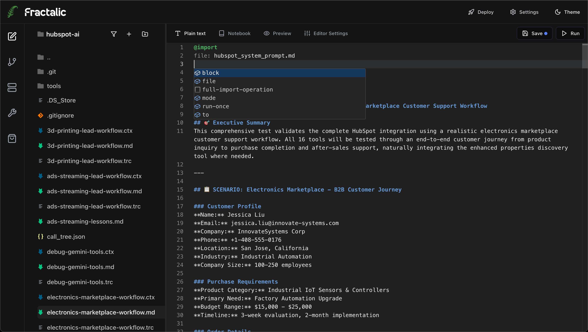
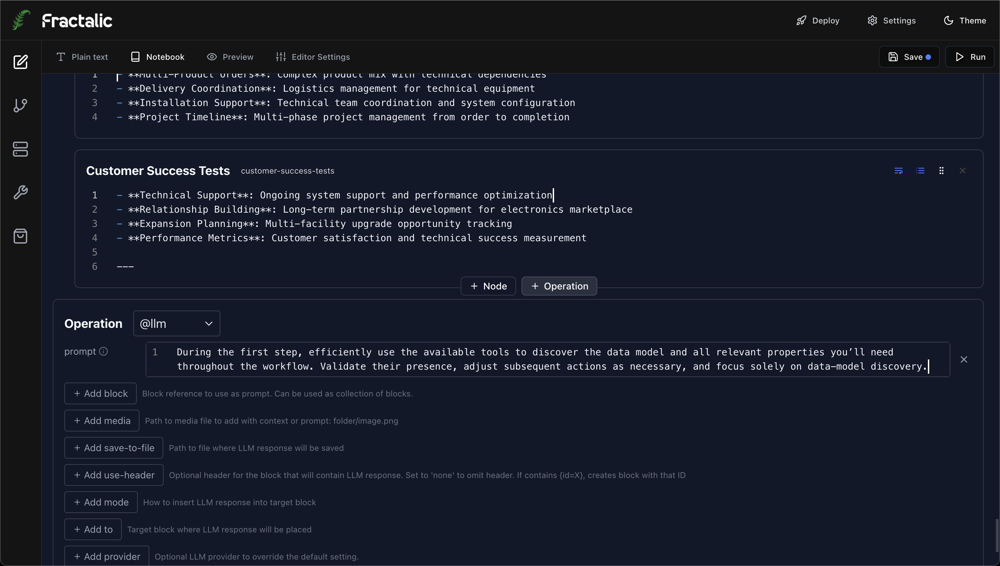
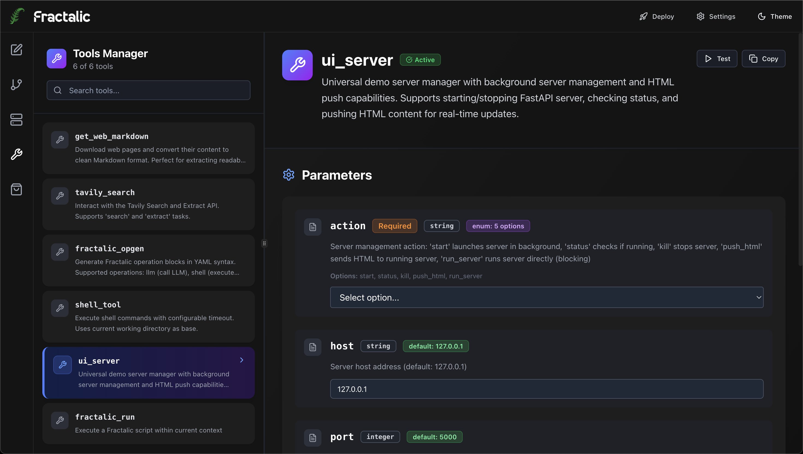
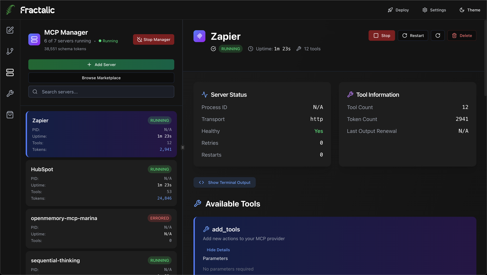
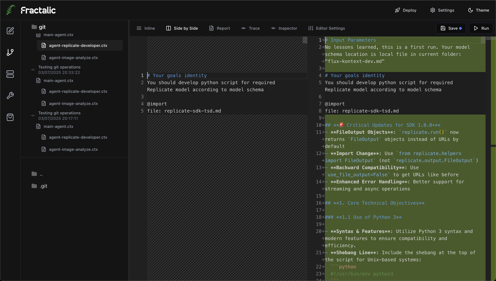
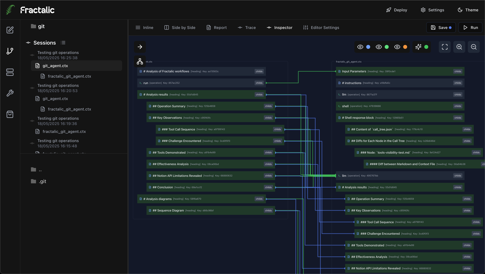
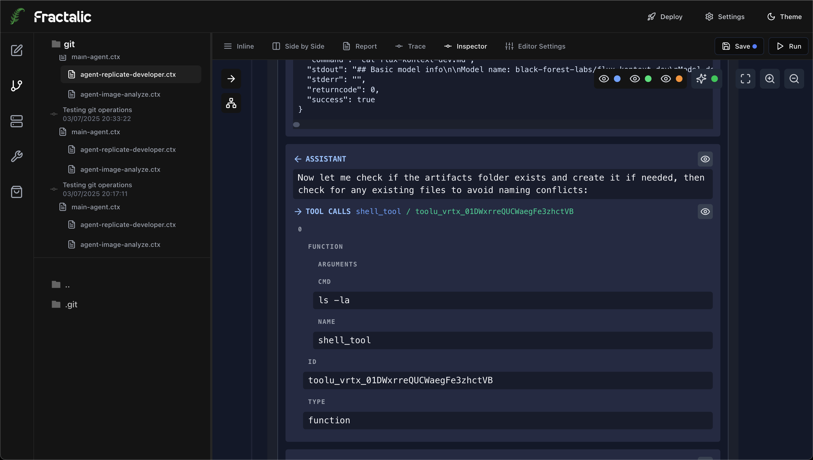
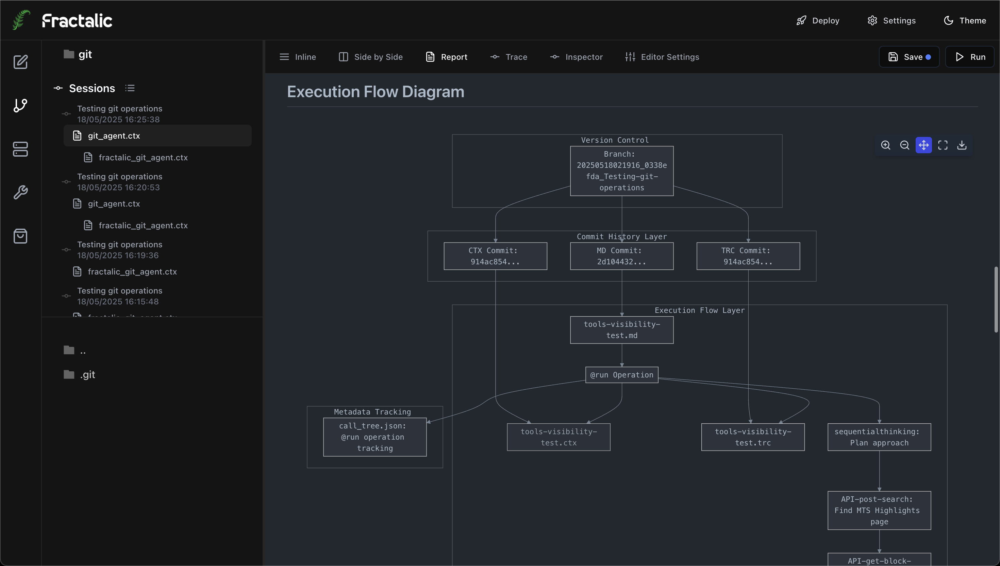
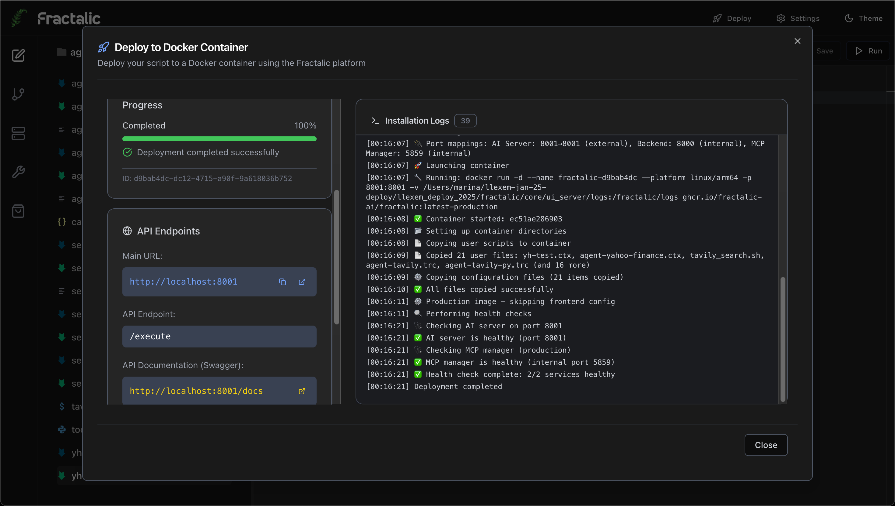

[](https://pypi.org/project/fractalic/) [](LICENSE.txt)   [](docs/)

<p align="center">
  
</p>

# What is Fractalic?
Design, run and evolve multi‑model AI workflows in one executable Markdown file—no glue code—with precise context control, tool integration and git‑traceable reproducibility.

## What's New in v0.1.1
This update focuses on making Fractalic more practical for everyday use. We added better model options, tool handling, and ways to deploy and debug. Here's a rundown of the changes.

### 🧠 AI & Model Support
- 🤖 LiteLLM integration, supporting over 100 models and providers.
- 🔄 Scripts now work as complete agents, with two-way parameter passing in LLM modes.
- 📊 Basic token tracking and cost analytics (still in early stages).
- 🧠 Improved context diffs (.ctx) for multi-model workflows.

### ⚡ MCP & Tool Ecosystem
- ⚡ Full MCP support, including schema caching.
- 🔐 OAuth 2.0 and token management for MCP services.
- 🛒 MCP marketplace in Fractalic Studio for one-click installs.
- 🔧 Fractalic Tools marketplace with one-click options: Telegram, HubSpot CRM, Tavily web search, MarkItDown, HubSpot process-mining, ultra-fast grep, file patching, and others.
- 🐍 Support for using Python modules as tools.
- 👁️ Tool call tracing, available in context and through the Studio inspector.

### 🚀 Deployment & Publishing
- 🚀 Publisher system with Docker builds and a lightweight server for REST APIs, including Swagger docs.
- 🐳 Automated deployments with process supervision.
- 📦 Fractalic now available as a Python package for standalone use or importing as a module.

### 🎨 Fractalic Studio (IDE)
- 🖥️ Development environment with session views, diff inspector, editor, and deployment tools.
- 📝 Notebook-style editor for building workflows step by step.
- 🛒 Integrated marketplaces for MCP servers and tools.
- 🔍 Debugging features like execution tracing and context inspection.

### 📚 Documentation & Stability
- 📖 Detailed docs covering all features and examples.
- 🛠️ Better stability for tool executions, with improved structured outputs.

## Table of Contents

- [Basic Principles](#basic-principles)
- [From Idea to Service in 5 Steps](#from-idea-to-service-in-5-steps)
- [How It Works](#how-it-works)
- [Operations](#operations)
- [Advanced: Let Models Control Flow](#advanced-let-models-control-flow)
- [Compression Pattern (Tool Output → Replace)](#compression-pattern-tool-output--replace)
- [Example](#example)
- [Extended Examples (MCP & Media)](#extended-examples-mcp--media)
- [Getting Started](#getting-started)
- [Common Uses](#common-uses)
- [Roadmap](#roadmap)
- [When Not to Use Fractalic](#when-not-to-use-fractalic)
- [License](#license)

## Basic Principles
- **One executable Markdown file**: Your workflow specification *is* your runtime. Write what you want in plain Markdown, run it directly. No translation between documentation and code.

- **No glue code**: Replace Python/JS/(any program language) orchestration scripts with 3-6 line YAML plain-text operations. 

- **Multi-model workflows**: Switch between LLM models and providers in the same document. 

- **Precise context control**: Your Markdown becomes a manageable LLM context as an addressable tree. Reference exact sections, branches, or lists. LLMs see only what you specify—no hidden prompt stuffing.

- **Tool integration**: Connect MCP servers, Python functions, and shell commands. All outputs flow back into your document structure for the next operation.

- **Human‑readable audit trail**: Each run outputs a stepwise execution tree plus a complete change log (new blocks, edits, tool calls). Skim it like a focused diff—only actions and their effects, no noise.

## From Idea to Service in 5 Steps

**1. Minimal workflow (hard‑coded input):**

Instructions live in the heading block (context). Prompts are terse triggers.
```markdown
# Market Research {id=task}
Goal: capture latest Apple quarterly results and produce a concise financial summary.
Required: core revenue, EPS, notable YoY deltas, one risk.
Produce two blocks: financial data (raw metrics) then analysis summary (bullet form).

@llm
prompt: Fetch results
tools:
  - tavily_search
use-header: "# Financial Data {id=financial-data}"

@llm
prompt: Summarize key metrics
blocks: financial-data
use-header: "# Analysis Summary {id=analysis-summary}"
```
Example output (diff):
```diff
+ # Financial Data {id=financial-data}
+ Apple Q2 2025: Revenue $82.9B (+6% YoY), EPS $1.32, Services +11%, Mac -4%...
+ # Analysis Summary {id=analysis-summary}
+ • Moderate top-line growth driven by Services
+ • Hardware softness isolated to Mac
+ • Margin stable; FX impact minimal
+ • Watch regulatory risk (EU DMA compliance)
```

Run:
```bash
python fractalic.py research.md
```

**2. Add dynamic input (parameter injection):**
Create a parameter file and inject it as `# Input Parameters`.
```bash
echo '# Input Parameters {id=input-parameters}\nCompany: Tesla' > params.md
python fractalic.py research.md --task_file params.md --param_input_user_request input-parameters
```
Modify workflow (reuse pattern; minimal prompts):
```markdown
# Market Research {id=task}
Input-driven company scan. Use 'input-parameters' for target. Extract latest quarter core metrics then bullet summary.

@import
blocks: input-parameters
mode: append

@llm
prompt: Fetch results
blocks: input-parameters
use-header: "# Financial Data {id=financial-data}"

@llm
prompt: Summarize
blocks: financial-data
use-header: "# Analysis Summary {id=analysis-summary}"
```
Diff after run (example):
```diff
+ # Input Parameters {id=input-parameters}
+ Company: Tesla
+ # Financial Data {id=financial-data}
+ Tesla Q4 2024: Revenue $25.2B (+9% YoY), EPS $0.78, Energy +30%...
+ # Analysis Summary {id=analysis-summary}
+ • Growth led by energy storage
+ • Automotive margin compression persists
+ • Cash position stable
+ • Watch pricing elasticity risk
```

**3. Inspect structured diff (.ctx):**
```diff
+ # Input Parameters {id=input-parameters}
+ Company: Tesla
+ # Financial Data {id=financial-data}
+ Tesla Q4 2024 results: Revenue ...
+ # Analysis Summary {id=analysis-summary}
+ • Growth drivers ...
```

**4. Add return for service interface:**
```markdown
@return
blocks: analysis-summary
```
Result: upstream caller (CLI / AI Server) receives only the summary.

**5. Call via AI Server (REST):**
```bash
curl -X POST http://localhost:8001/execute \
  -H 'Content-Type: application/json' \
  -d '{"filename": "research.md", "parameter_text": "Company: Nvidia"}'
```
Server auto-creates an in‑memory `# Input Parameters {id=input-parameters}` block from `parameter_text`.

**Result:** Same Markdown becomes an on-demand research microservice. No placeholders, no template engine.

## How It Works
Your Markdown document becomes three things:

**Document tree**: Headings create addressable blocks. Reference exact sections (`block_uri: idea`) or branches (`idea/*`). 

**Operation sequence**: `@llm`, `@shell`, `@run` operations execute in order. Each changes your document structure predictably.

**Context window**: Models see only the blocks you specify. No hidden prompt stuffing.

## Operations
Five operations control your workflow:

- `@llm` – Send specific blocks to any model. GPT-4, Claude, local models.
- `@shell` – Run terminal commands. Output becomes a new block.
- `@run` – Execute another Markdown file. Pass parameters, get results back.
- `@import` – Include content from other files.
- `@return` – Send blocks back to parent workflow.

## Advanced: Let Models Control Flow
Give models tools to extend your workflow:
- `fractalic_run` – Model decides when to spawn sub-workflows
- `fractalic_opgen` – Model generates new operations to execute

This creates self-extending workflows without custom code.

## Compression Pattern (Tool Output → Replace)
Use when a raw tool or multi-turn capture block is large and stabilized. Rationale: reduce token cost while preserving essential facts.

```markdown
# Trend Scan {id=trend-scan}
Goal: gather emerging AI agent frameworks (≤4 weeks), capture raw notes, then compress.
Keep framework name, category, single differentiator.

@llm
prompt: Collect sources
tools:
  - tavily_search
use-header: "# Raw Sources {id=raw-sources}"

@llm
prompt: Compress essentials
blocks: raw-sources
mode: replace
to: raw-sources
use-header: "# Raw Sources {id=raw-sources}"
```
Example diff (initial creation):
```diff
+ # Raw Sources {id=raw-sources}
+ Framework A: launch blog snippet ... (3 lines details)
+ Framework B: GitHub trending note ...
+ Framework C: ...
```
After compression (replace):
```diff
# Raw Sources {id=raw-sources}
- Framework A: launch blog snippet ... (3 lines details)
- Framework B: GitHub trending note full paragraph...
- Framework C: long description...
+ Framework A | orchestration | agent graph focus
+ Framework B | memory | fast vector sync
+ Framework C | evaluation | scenario DSL
```
Reason for `replace`: raw text no longer needed; distilled lines cheaper to reuse.

## Example
```markdown
# Launch Brief {id=brief}
We need a launch narrative for our AI workflow feature.

@llm
prompt: List pains
blocks: brief
mode: append

@shell
command: curl api.example.com/trends > trends.json

@llm
prompt: Draft narrative
blocks: brief/*
use-header: "# Draft {id=draft}"

@return
blocks: draft
```

## Extended Examples (MCP & Media)

### Web Search → Notion Page (MCP tavily_search + mcp/notion)
```markdown
# Agent Framework Brief {id=agent-brief}
Track emerging AI agent frameworks (≤4 weeks) and store a concise structured summary into Notion.

@llm
prompt: Gather frameworks
blocks: agent-brief
tools:
  - tavily_search
tools-turns-max: 2
use-header: "# Source Notes {id=source-notes}"

@llm
prompt: Create Notion page
blocks: source-notes
tools:
  - mcp/notion
tools-turns-max: 3
use-header: "# Notion Result {id=notion-result}"

@return
blocks: notion-result
```
Example diff:
```diff
+ # Source Notes {id=source-notes}
+ Framework X | routing | dynamic graph...
+ Framework Y | memory | episodic store...
+ # Notion Result {id=notion-result}
+ Notion page created: Agent Framework Trends — 2025-09-13 (id: abc123)
```

### Replicate Image (flux-dev) + Simple Download
```markdown
# Visual Asset Generation {id=visual-goal}
Goal: single flux-dev image (agent nodes neon network dark background). Steps:
1. Call replicate model (flux-dev) and capture raw JSON (do not trim keys inside predictions[0]).
2. Extract first image URL to its own block (plain URL only).
3. Use shell_tool to download the file to image.png (single curl). Keep log minimal.

@llm
prompt: Run model
blocks: visual-goal
tools:
  - mcp/replicate
tools-turns-max: 2
use-header: "# Raw Generation {id=raw-generation}"

@llm
prompt: URL only
blocks: raw-generation
use-header: "# Image URL {id=image-url}"

@llm
prompt: Download
blocks: image-url
tools:
  - shell_tool
tools-turns-max: 1
use-header: "# Download Log {id=download-log}"

@return
blocks:
  - image-url
  - download-log
```
Example diff:
```diff
+ # Raw Generation {id=raw-generation}
+ {"predictions":[{"id":"p123","model":"flux-dev","status":"succeeded","output":["https://replicate.delivery/pbxt/asset123.png"]}]}
+ # Image URL {id=image-url}
+ https://replicate.delivery/pbxt/asset123.png
+ # Download Log {id=download-log}
+ curl -L -o image.png https://replicate.delivery/pbxt/asset123.png
+ Saved image.png (512KB)
```

## Getting Started

### Installation

#### Method 1: Pre-Built Docker Image (Recommended)
Run the published container directly with all services (UI + API + AI server):
```bash
docker run -d --name fractalic --network bridge -p 3000:3000 -p 8000:8000 -p 8001:8001 -p 5859:5859 -v /var/run/docker.sock:/var/run/docker.sock --env HOST=0.0.0.0 ghcr.io/fractalic-ai/fractalic:main
```
Then open: http://localhost:3000

#### Method 2: Build from Source (Full Stack)
Builds latest version from GitHub repositories and runs in Docker:
```bash
curl -s https://raw.githubusercontent.com/fractalic-ai/fractalic/main/deploy/docker-deploy.sh | bash
```
This clones both fractalic + fractalic-ui, builds Docker image locally, and starts all services:
- UI: http://localhost:3000
- API: http://localhost:8000
- AI Server: http://localhost:8001
- MCP Manager: http://localhost:5859

#### Method 3: Local Development Setup
Full source installation with both backend and frontend for development:
```bash
git clone https://github.com/fractalic-ai/fractalic.git
cd fractalic
./local-dev-setup.sh
```
This script will:
- Clone fractalic-ui repository
- Set up Python virtual environment
- Install all dependencies
- Start both backend and frontend servers
- Open http://localhost:3000 automatically

#### Method 4: Python Package (CLI Only)
Install when you only need the command-line runner (no UI):
```bash
pip install fractalic
```

##### Basic CLI Usage
Check install:
```bash
fractalic --help
```
Create and run a minimal workflow:
```bash
cat > hello.md <<'EOF'
# Goal {id=goal}
Generate a short greeting.

@llm
prompt: Greeting
blocks: goal
use-header: "# Result {id=result}"
EOF

fractalic hello.md
```

##### Usage as Python Module
```python
import fractalic

# Run a workflow file
result = fractalic.run('workflow.md')

# Run with parameters
result = fractalic.run('workflow.md', parameters={'company': 'Tesla'})

# Run workflow content directly
workflow_content = """
# Analysis {id=task}
Research the company mentioned in parameters.

@llm
prompt: Analyze
blocks: task
"""
result = fractalic.run_content(workflow_content, parameters={'company': 'Apple'})
print(result)
```


## Screenshots

<table>
  <tr>
    <td width="50%">
      
      <p align="center"><em>Main Editor Interface</em></p>
    </td>
    <td width="50%">
      
      <p align="center"><em>Notebook Execution View</em></p>
    </td>
  </tr>
  <tr>
    <td width="50%">
      
      <p align="center"><em>MCP Tools Integration</em></p>
    </td>
    <td width="50%">
      
      <p align="center"><em>MCP Manager Interface</em></p>
    </td>
  </tr>
  <tr>
    <td width="50%">
      
      <p align="center"><em>Git-backed Execution Diffs</em></p>
    </td>
    <td width="50%">
      
      <p align="center"><em>Debug Inspector</em></p>
    </td>
  </tr>
  <tr>
    <td width="50%">
      
      <p align="center"><em>Message Inspector</em></p>
    </td>
    <td width="50%">
      
      <p align="center"><em>Markdown Editor</em></p>
    </td>
  </tr>
  <tr>
    <td colspan="2" align="center">
      
      <p align="center"><em>Deployment Dashboard</em></p>
    </td>
  </tr>
</table>

## Integrations & Credits
- LiteLLM (https://github.com/BerriAI/litellm)
- FastMCP (https://github.com/jlowin/fastmcp)

## License
MIT